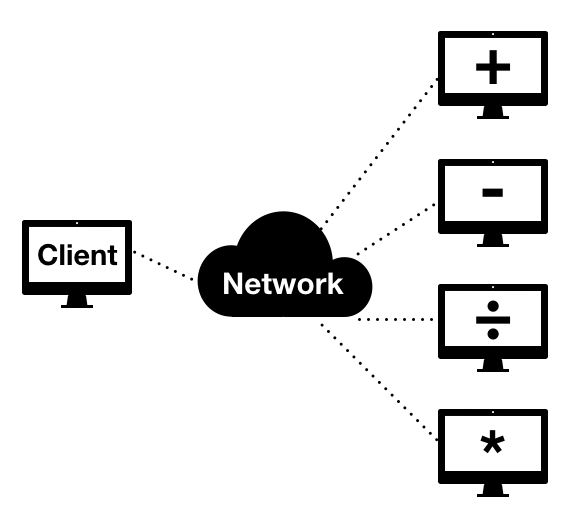

# Distributed calculator 

In this project, I implement a Distributed Calculator using JAVA. The idea beyond this is to send in the network the numbers of an operation, the basics ones, and another computer does the math and sends back to the client. The picture below shows how it works.

 system Architecture

# How to execute/test this?

There are, basically, two ways to execute/test. The first one is opening 5 terminals in your own computer, one for the client and 4 for the operators. The second one and the most interesting one is to execute in 5 distinct computers in the same network.

# How to compile? (LINUX and MAC OS X)

To compile the client you should open your terminal and type:

    javac UserInterface.java
    
To run you should put the port that the communication will go through, I will put port 4000 just as an example. The IP Server will be its own IP

    java UserInterface 4000
    
To compile the operators, you should type:

      javac Operator.java
      
To run you should put the Server IP, the port of the communication and how operation this operator will do (ADD, SUB, MUL or DIV). the example bellow is for an ADD operator connecting in a Server IP 192.168.70.100

      java Operator 192.168.70.100 4000 ADD
      
After the for operator been connected, the Client will be able to perform the calculations. 

#PS: Feel free to fork, comment, ask, criticism or suggest something to improve this project.
